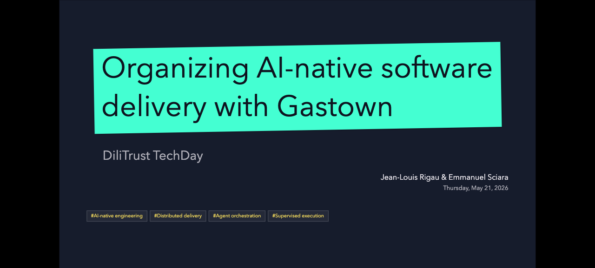

# Gastown DiliTrust Presentation

Presentation deck for the DiliTrust TechDay talk **Organizing AI-native software delivery with Gastown**.



## About the Deck

This deck introduces Gastown as an operating model for AI-native software delivery. It starts from the evolution of individual AI coding practices, then moves into the coordination problem that appears when many coding agents work on real repositories.

The presentation covers:

- why single-agent workflows break down when delivery becomes distributed;
- how Gastown organizes work through towns, rigs, the Mayor, beads, convoys, Polecats, Witness and Refinery;
- how supervision, recovery and verification make agent execution operational;
- a live Agreement Hub demo used as a realistic software delivery target;
- how formulas can turn orchestration patterns into repeatable delivery playbooks.

The published slides are available at:

```text
https://manufacture.dev/gastown-dilitrust-presentation
```

## Slidev

This repository is configured to build a Slidev presentation from `slides.md`.

Useful commands:

```bash
npm install
npm run dev
npm run build
npm run export
npm run export:pptx
```

- `npm run dev` starts the live presentation server.
- `npm run build` creates the static website in `dist/`.
- `npm run export` renders a PDF named `gastown-dilitrust-presentation.pdf`.
- `npm run export:pptx` renders a PowerPoint file.

## GitHub Pages

The slides are published as a static Slidev site through GitHub Actions.

Before the first deployment, configure the repository on GitHub:

1. Open `Settings` > `Pages`.
2. Set `Build and deployment` > `Source` to `GitHub Actions`.
3. Push to `main` or run the `Deploy slides to GitHub Pages` workflow manually.

The workflow builds Slidev with `/gastown-dilitrust-presentation/` as its base path for the organization Pages URL:

```text
https://manufacture-dev.github.io/gastown-dilitrust-presentation/
```

## Releases

When a GitHub release is published, the `Attach release artifacts` workflow exports the slides as:

- `gastown-dilitrust-presentation.pdf`
- `gastown-dilitrust-presentation.pptx`

The generated files are attached to the release assets.
