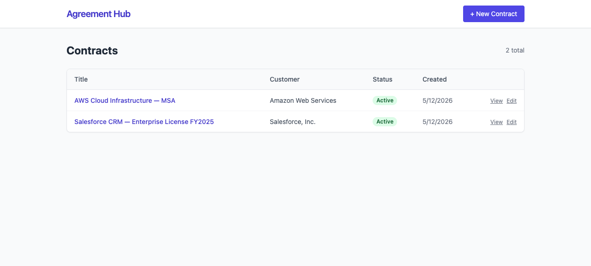

# Organizing AI-native software delivery with Gastown

DiliTrust TechDay

Jean-Louis Rigau & Emmanuel Sciara

Thursday, May 21, 2026

  #AI-native engineering
  #Distributed delivery
  #Agent orchestration
  #Supervised execution

<!--
Open on the model, not the tooling.
This is not "AI coding faster"; it is how delivery gets organized when AI workers become part of the engineering system.
-->

---

# Speakers

  <article class="speaker-card">
    <figure class="speaker-photo speaker-photo--jean">
      
    </figure>
    

      Speaker
      <h2>Jean-Louis Rigau</h2>
      
Engineering and AI-native transformation advisor. Helps organizations modernize platforms, delivery practices, product operating models and agentic workflows.

      

        
        <a href="https://www.linkedin.com/in/jlrigau/" target="_blank" rel="noopener noreferrer">linkedin.com/in/jlrigau</a>
      

    

  </article>
  <article class="speaker-card">
    <figure class="speaker-photo speaker-photo--emmanuel">
      
    </figure>
    

      Speaker
      <h2>Emmanuel Sciara</h2>
      
Agent Lead and AI-native Engineer. Works on strategy, deployment and coaching of coding agents, with hands-on Claude Code and developer enablement.

      

        
        <a href="https://www.linkedin.com/in/emmanuelsciara/" target="_blank" rel="noopener noreferrer">linkedin.com/in/emmanuelsciara</a>
      

    

  </article>

<!--
Introduce the two presenters before moving into the AI practice evolution.
Keep the slide simple: names, photos, and the angle each speaker brings to the story.
-->

---

# The 8 stages of AI development practice

  

    
1
Zero or near-zero AI

    
2
IDE assistant with permissions

    
3
IDE agent in YOLO mode

    
4
Wide agent inside the IDE

    
5
Single CLI coding agent

    
6
Multi-agent CLI workflow

    
7
10+ agents, hand-managed

    
8
Building an orchestrator

  

  

    Practice shift
    
The shift is from asking an assistant to operating a delivery system.

    <ul>
      <li>Early stages improve individual flow.</li>
      <li>Middle stages increase throughput with CLI agents.</li>
      <li>Late stages create a coordination problem.</li>
      <li>Gastown appears when hand-management stops scaling.</li>
    </ul>
  

  
AI development evolves from individual assistance to organizational coordination.

<!--
Inspired by Steve Yegge's "The 8 Stages of Dev Evolution To AI" framing.
Use this as the bridge from personal AI practice to organizational orchestration.
-->

---

# Steve Yegge

  <figure class="creator-photo">
    
  </figure>
  

    From practice to organization
    
Steve Yegge frames the shift from individual AI coding to AI-native software delivery.

    

      

        <strong><em><a href="https://itrevolution.com/product/vibe-coding-book/" target="_blank" rel="noopener noreferrer">Vibe Coding</a></em></strong>
        
Production-grade software with AI coding agents.

      

      

        <strong><a href="https://github.com/gastownhall/gastown" target="_blank" rel="noopener noreferrer">Gastown</a></strong>
        
An operating model for coordinating many agents around real repositories.

      

      

        <strong><a href="https://github.com/gastownhall/beads" target="_blank" rel="noopener noreferrer">Beads</a></strong>
        
A Git-backed work ledger for agentic engineering workflows.

      

    

  

  <figure class="book-cover">
    
  </figure>

<!--
Use this slide to ground the story in Steve Yegge's work before introducing the delivery problem.
Keep it short: creator, book, why it matters for the model.
-->

---

# Gastown: a town-shaped delivery system

  

    

      Town
      <strong>Agent headquarters</strong>
      
A separate operating space where orchestration, identity, mail, and work tracking live.

    

    

    

      Mayor
      <strong>Chief of staff</strong>
      
The front door: absorbs worker noise and turns intent into coordinated work.

    

    

      Rigs
      <strong>Project factories</strong>
      
Polecats, Crew, Witness and Refinery operate around real repositories.

    

  

  

    Town as operating model
    
Gastown makes vibe coding operational without pretending the chaos disappears.

    <ul>
      <li>Many coding agents become first-class workers with visible identities.</li>
      <li>Beads provide the Git-backed ledger for work, memory, mail, and provenance.</li>
      <li>Convoys track delivery streams; Polecats execute the work.</li>
      <li>Witness and Refinery keep the system from turning into merge chaos.</li>
    </ul>
  

  
Gastown turns agentic coding into observable, coordinated software delivery.

<!--
Use this slide as the atmosphere and vocabulary bridge before the problem slide.
The story: Gas Town starts from vibe-coding chaos, then adds city-like operating roles so delivery can be supervised.
-->

---

# Demo application

  

    Agreement Hub
    
A CRUD Contract Lifecycle Management application used as a realistic delivery target.

    <ul>
      <li>Stack: React/Vite frontend, Express/TypeScript backend, SQLite database.</li>
      <li>Gastown works on a forked repository, so the demo starts from a clean baseline.</li>
      <li>The demo is real: the outcome may differ from the initial plan.</li>
    </ul>
  

  

    

      
    

  

  

    Demo flow
    
Start the demo loop: open Agreement Hub → show current state → ask the Mayor. From here, each Live Signal marks what to observe next.

  

  <a class="app-open-link" href="http://localhost:5173/" target="_blank" rel="noopener noreferrer">Open app ↗</a>

<!--
LIVE START:
- Launch Gastown.
- Present Agreement Hub in the browser.
- Ask the Mayor for the first implementation step.
Contract: the deck explains, the terminal works, the app proves.
-->

---

# Why single-agent workflows break

  

    

      

        Single agent
        <strong>Great local assistant</strong>
        
One context, one thread of execution, one working branch.

      

      

        01
        <strong>Context saturation</strong>
        
Important constraints disappear as the session grows.

      

      

        02
        <strong>Sequential execution</strong>
        
Throughput is bounded by one worker loop.

      

      

        03
        <strong>No coordination layer</strong>
        
Dependencies and ownership stay implicit.

      

      

        04
        <strong>Merge pressure</strong>
        
Parallel changes become hard to integrate safely.

      

      

        05
        <strong>No operational supervision</strong>
        
Stuck work is difficult to observe and recover.

      

    

  

  

    Problem
    
AI coding works locally, but software delivery is organizational.

    <ul>
      <li>Context windows do not model dependencies.</li>
      <li>Sequential work limits throughput.</li>
      <li>Parallel work creates integration pressure.</li>
      <li>Supervision becomes a first-class concern.</li>
    </ul>
    
Software delivery is organizational. The bottleneck becomes coordination.

  

<!--
The audience should understand why Gastown exists before we introduce roles.
The bottleneck is not just model intelligence; it is coordination.
-->

---

# Gastown organizes work, not prompts

  

    

      

        Input
        <strong>Human intent</strong>
        
Natural language request, incomplete by design.

      

      

        Organization layer
        <strong>Gastown structures delivery</strong>
        

          
<b>Mayor</b> plans and coordinates.

          
<b>Beads</b> make work addressable.

          
<b>Convoys</b> track delivery streams.

          
<b>Witness & Refinery</b> keep execution observable.

        

      

      

        Output
        <strong>Observable delivery</strong>
        
Status, dependencies, ownership, progress, and merge flow become inspectable.

      

    

  

  

    Response
    
Gastown turns intent into shared delivery objects.

    <ul>
      <li>Mayor separates planning from execution.</li>
      <li>Beads and convoys make work addressable and trackable.</li>
      <li>Witness and Refinery make supervision and convergence visible.</li>
    </ul>
    
Scale comes from shared coordination, not bigger prompts.

  

The Mayor turns a high-level request into beads, convoys, assignments, and visible status.

<!--
Use this slide to position Gastown as an AI-native delivery organization.
Avoid tool tour language.
-->

---

# The Organization

  

    

      

        Town
        

          

            <strong>👁️ Overseer</strong>
            
Human intent and control

          

          

            <strong>🏛️ Mayor</strong>
            
Cross-rig coordination

          

          

            <strong>🐺 Deacon</strong>
            
System health

          

        

      

      

        Rig
        
A project repository with its own execution environment.

        

          

            <strong>👥 Crew</strong>
            
Persistent workers

          

          

            <strong>😺 Polecats</strong>
            
Ephemeral workers

          

          

            <strong>🦉 Witness</strong>
            
Rig supervision

          

          

            <strong>🏭 Refinery</strong>
            
Merge queue

          

        

      

    

  

  

    Why it matters
    
Gastown is organized around a town and one or more rigs.

    <ul>
      <li>The Town coordinates across repositories.</li>
      <li>Each Rig is attached to a real codebase.</li>
      <li>Crew members are persistent; Polecats are disposable execution workers.</li>
      <li>Witness and Refinery are rig-level operating roles.</li>
    </ul>
    
Gastown separates coordination, execution, supervision, and integration.

  

Identify the rig, the persistent crew, and the disposable workers attached to the repository.

<!--
This is a central slide. The key line is:
The Mayor coordinates work. Polecats execute it.
-->

---

# Beads: work breakdown & dependencies

  

    

      
      
      
      
      
      
      
      
      
      
      
      
      
      

        Phase 0 — Foundations
        <strong>Schema enrichment · RiskFinding type · LLM wrapper</strong>
      

      

        Use Case 5
        <strong>Clause Library</strong>
        <em>Reusable templates</em>
      

      

        Use Case 3
        <strong>Approval Workflow</strong>
        <em>State and history</em>
      

      

        Use Case 1
        <strong>Clause Generator</strong>
        <em>Can save clauses</em>
      

      

        Use Case 2
        <strong>Risk Reviewer</strong>
        <em>Persists findings</em>
      

      
Saved generated clauses to library

      
risky / GDPR facets need persisted findings

      

        Use Case 4 — last mile
        <strong>Search / Intelligence</strong>
        <em>Uses schema, metadata, and risk findings</em>
      

      
Critical path

    

  

  

    Why it matters
    
Beads turn a high-level request into executable work with order, ownership, and status.

    <ul>
      <li>Dependencies expose the critical path.</li>
      <li>Ready work can be executed immediately.</li>
      <li>Blocked work is visible instead of implicit.</li>
      <li>Hooks keep workers connected to active assignments.</li>
    </ul>
    
Beads expose what can start now, what is blocked, and why.

  

Bead creation, ready/blocked status, dependency graph, and current hook.

<!--
Use this slide to explain why dependency management matters.
The important point: work becomes executable and inspectable.
-->

---

# Convoys: delivery streams

  

    

      

        <b class="convoy-step">Step 0</b>
        🚚 Phase 0 convoy
        <strong>Foundations</strong>
        <em>shared base · unlocks Use Cases 1-5</em>
      

      

        

          <b class="convoy-step">Step 1</b>
          🚚 Use Case 5 convoy
          <strong>Clause Library</strong>
          <em>CRUD stream · reusable clauses</em>
        

        

          <b class="convoy-step">Step 1</b>
          🚚 Use Case 3 convoy
          <strong>Approval Workflow</strong>
          <em>state machine · history</em>
        

        

          <b class="convoy-step">Step 2</b>
          🚚 Use Case 1 convoy
          <strong>Clause Generator</strong>
          <em>AI stream · saves to library</em>
        

        

          <b class="convoy-step">Step 2</b>
          🚚 Use Case 2 convoy
          <strong>Risk Reviewer</strong>
          <em>AI stream · persisted findings</em>
        

        

          <b class="convoy-step">Step 3</b>
          🚚 Use Case 4 convoy
          <strong>Search / Intelligence</strong>
          <em>last mile · depends on schema and risk findings</em>
        

      

    

  

  

    Why it matters
    
Convoys make each use case visible as a delivery stream.

    <ul>
      <li>Same step number means parallel work.</li>
      <li>Progress becomes visible across workers.</li>
      <li>Shared reference across roles.</li>
    </ul>
    
Convoys turn the bead graph into observable delivery streams.

  

Convoy creation, convoy status, and landing notification.

<!--
Convoys should feel operational, not decorative.
They are the shared handle for distributed delivery.
-->

---

# Polecats: parallel execution

  

    

      

        Polecats
        Beads
      

      

        

          😺 furiosa
        

        

          
Foundations Clause Library Risk Reviewer

        

      

      

        

          😺 nux
        

        

          
Contract Approval Workflow

        

      

      

        

          😺 slit
        

        

          
Clause Generator Search / Intelligence MVP

        

      

      

        One product request
        <i>↓</i>
        Scoped beads
        <i>↓</i>
        Isolated execution workers (Polecats)
        <i>↓</i>
        Coordinated delivery
      

    

  

  

    Why it matters
    
The Mayor assigns scoped beads to Polecats, each running in its own context and branch.

    <ul>
      <li>Spawned on demand for discrete tasks.</li>
      <li>Assignments stay isolated from each other.</li>
      <li>Polecats disappear after delivery.</li>
      <li>Parallelism increases throughput, not chaos.</li>
    </ul>
    
Polecats make execution scalable by distributing work across isolated contexts.

  

Multiple Polecats, branches, commits, and delivery statuses running at the same time.

<!--
This is the "wow" moment, but keep it engineering-oriented.
The claim is throughput through isolated execution.
-->

---

# Supervision keeps execution operational

  

      

      
HQ watchdog chain

      

        <strong>🏛️ Mayor</strong>
        
Coordinates work

      

      

        <strong>🐺 Deacon</strong>
        
Town watchdog · lifecycle · recovery

      

      
⚙️ Daemon <small>mechanical heartbeat</small>

      

        

          <strong>🐕 Boot the Dog</strong>
          
Checks Deacon health

        

        

          <strong>🐶 Dogs</strong>
          
Deacon helpers

        

      

      

      
Rig operational loop

      

        <strong>👥 Crew</strong>
        
Persistent workers

      

      

        <strong>🦉 Witness</strong>
        
Monitors Polecats · detects stuck work · nudges recovery

      

      

        

          <strong>😺 Polecats</strong>
          
Execute beads

        

        

          <strong>🏭 Refinery</strong>
          
Merge queue · delivery convergence

        

      

    

  

  

    Why it matters
    
Gastown supervision is layered, not a single watcher.

    <ul>
      <li>Daemon wakes Boot when health needs checking.</li>
      <li>Deacon keeps the town healthy.</li>
      <li>Witness keeps rig execution moving.</li>
      <li>Refinery keeps delivery converging.</li>
    </ul>
    
Supervision turns distributed execution into an operational system.

  

Deacon health, Witness status, Polecat recovery, Refinery queue, and delivery convergence.

<!--
Important for DiliTrust: supervision and control are not optional.
This slide turns distributed execution into an operational system.
-->

---

# Agreement Hub verification

  

    Local inspection
    
We inspect the delivered repository by running Agreement Hub locally and comparing it with the starting version.

    <ul>
      <li>The app is not deployed during the demo.</li>
      <li>We clone the complete repository produced by Gastown.</li>
      <li>We run that repository locally, then compare it with the baseline app.</li>
    </ul>
    
What will the delivered app reveal?

  

  

    <strong>Implemented use cases</strong>
    Clause Generator <i></i>
    Risk Reviewer <i></i>
    Approval Workflow <i></i>
    Search & Intelligence <i></i>
    Clause Library <i></i>
  

  

    Verification checkpoint
    
The Gastown delivery loop pauses here. Now we clone the delivered repository, run Agreement Hub locally, and compare it with the starting application.

  

  <a class="app-open-link" href="http://localhost:5173/" target="_blank" rel="noopener noreferrer">Open app ↗</a>

<!--
Switch to the browser and slow down.
The audience must see that Agreement Hub changed because Gastown delivered code.
-->

---

# Going further with formulas

  

    

      Formula
      
A formula turns an orchestration pattern into a repeatable delivery playbook: steps, inputs, gates, parallel work, and artifacts.

    

    

      <h2>Example</h2>
      <strong>mol-idea-to-plan</strong>
      
From vague idea to reviewed plan and work ready to become beads.

      <a href="https://github.com/gastownhall/gastown/blob/v1.1.0/internal/formula/formulas/mol-idea-to-plan.formula.toml" target="_blank" rel="noopener noreferrer">Open formula on GitHub</a>
    

    
Formulas make orchestration reusable: the workflow becomes part of the delivery system.

  

  

    

      01 · You → Crew
      
Describe your idea in natural language; no structure needed.

    

    

      02 · intake
      
Agent structures it into a draft PRD.

    

    

      03 · prd-review
      
6 polecats review PRD in parallel: requirements, gaps, ambiguity, feasibility, scope and stakeholders.

    

    

      04 · human-clarify
      
Agent presents consolidated questions; the human answers before planning continues.

    

    

      05 · generate-plan
      
6 polecats design the implementation in parallel: API, data, UX, scale, security and integration.

    

    

      06 · prd-align 1-3
      
3 rounds × 2 Polecats align plan with PRD and apply fixes each round.

    

    

      07 · plan-review 1-3
      
3 rounds × 2 Polecats review the plan itself: completeness, sequencing, risk, scope creep, testability and coherence.

    

    

      08 · create-beads
      
Agent converts the refined plan into beads with dependencies.

    

    

      09 · verify-beads
      
3 sequential passes compare plan to beads and fill gaps.

    

  

<!--
Use this slide after the live proof to show how the model can become reusable.
The mol-idea-to-plan formula is the concrete example: vague idea to reviewed plan to beads.
-->

---

# What Gastown changed

  

    

      Problem
      <strong>Single-agent workflows break when coding becomes delivery.</strong>
    

    

      Gastown response
      <strong>Turn delivery into a supervised, distributed operating model.</strong>
    

  

  

    01
    

      <strong>Context saturation</strong>
      
Important constraints disappear as the session grows.

    

    <em>Structure work into beads, artifacts, and explicit handoffs.</em>
  

  

    02
    

      <strong>Sequential execution</strong>
      
Throughput is bounded by one worker loop.

    

    <em>Use Polecats to execute independent work in parallel.</em>
  

  

    03
    

      <strong>No coordination layer</strong>
      
Dependencies and ownership stay implicit.

    

    <em>Mayor, Crew and Convoys make ownership and progress visible.</em>
  

  

    04
    

      <strong>Merge pressure</strong>
      
Parallel changes become hard to integrate safely.

    

    <em>Refinery manages convergence instead of leaving integration to chance.</em>
  

  

    05
    

      <strong>No operational supervision</strong>
      
Stuck work is difficult to observe and recover.

    

    <em>Witness, Deacon and recovery loops keep execution observable.</em>
  

<!--
This closes the conceptual loop with the exact five problems introduced earlier.
-->

---

# Thank you

## Questions & discussion

Gastown as an AI-native software delivery organization.

  Example questions
  
What does it cost to deliver a feature with Gastown?

  
How much control do we have over the models?

  
When should we use the Crew instead of only the Mayor?

<!--
Final slide for Q&A.
Keep it quiet. Do not add new concepts.
-->
